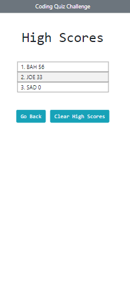
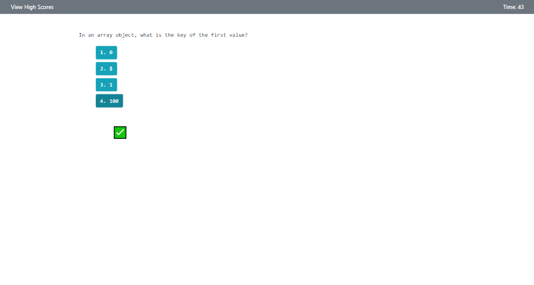

# Code Quiz

For this assignment, I was tasked with to building a timed coding quiz with multiple-choice questions. This app runs in the browser and features dynamically updated HTML and CSS powered by JavaScript code. The interface is clean, polished, and responsive.  

As the user interacts with the quiz, here is the criteria of the game play:

    * When the user clicks to start the quiz a timer begins and they are presented with a question 
    * When the user answers a question, they are presented with another question
    * When a user answers a question incorrectly, time is subtracted from the clock 
    * The game is over when all teh questions are answered or the timer reaches 0
    * If the user doesn't answer any questions correctly or the timer reaches 0, their score will be 0
    * When the game is over, the user can submit their initials along with their score
    * After submitting their initials / score, they are taken to a page with stored High scores
    * On the High Scores page, scores are presented highest to lwest. The user can clear the High scores and/or go back to take the quiz again

## Deployed Application Link:

https://bahuisken.github.io/Code-Quiz/

## Screenshots

- Mobile

- Desktop

## License

No License
